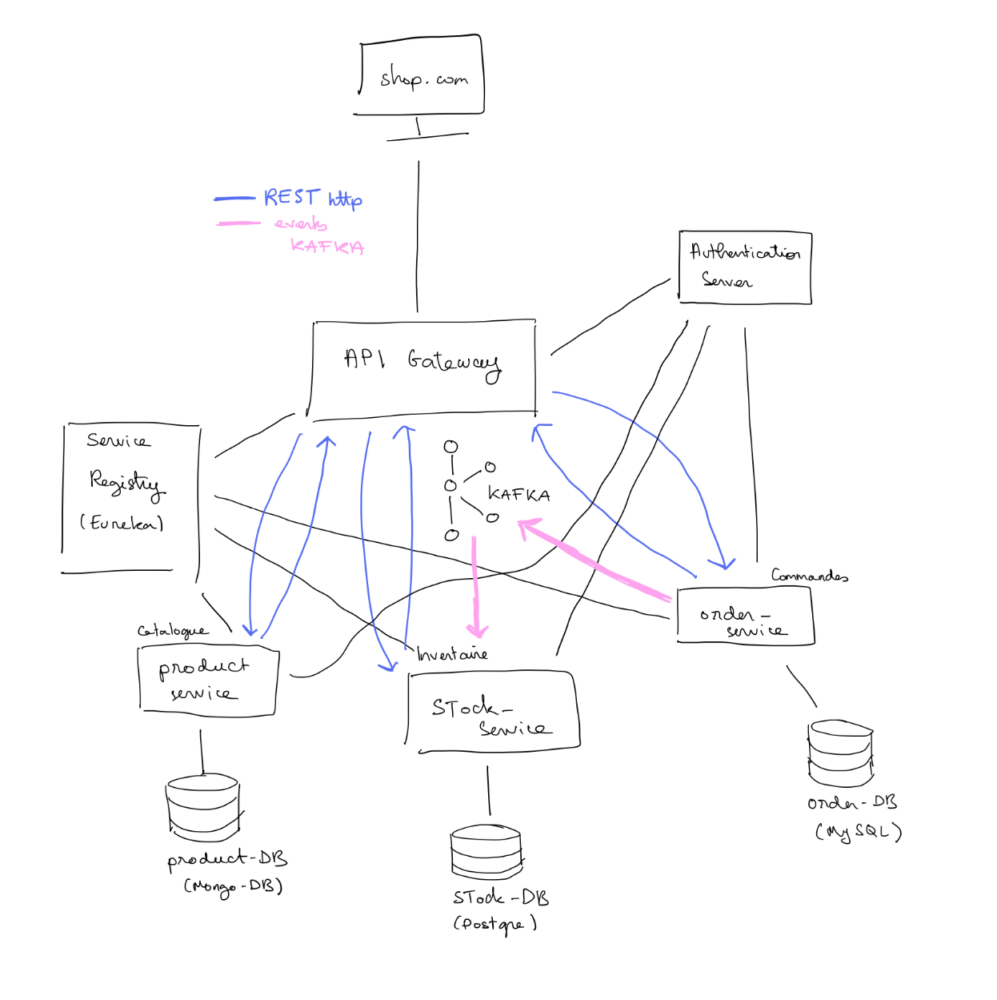

# E-commerce-microservices-app

## Developers
Liam BOUDADI & Chloé VARIN

## About the project
This project is a microservices architecture for an e-commerce application. It was made in the context of a school project
to implement an event driven mmicroservices architecture.
It is composed of 8 services:
- **Product Service**: manages the products of the e-commerce application
- **Order Service**: manages the orders of the e-commerce application
- **Stock Service**: manages the stock of the products
- **Gateway Service**: is the entry point of the application, it routes the requests to the right service
- **Eureka Service**: is the service registry, it allows the services to register and discover each other
- **Kafka Service**: is the message broker, it allows the services to communicate asynchronously
- **Zookeeper Service**: is the coordination service for Kafka
- **Frontend**: is the frontend of the application

Here is the architecture of the application:


### Interoperability and scalability
The services communicate with each other using REST APIs and Kafka. The services are independent and can be deployed 
separately. This allows to scale the services independently and to replace them without affecting the other services.

## Project structure
The project is structured as follows:
```
├── eureka-server
├── events-models
├── frontend
├── gateway-service
├── order-service
├── product-service
├── stock-service
└── docker-compose.yaml
```

## Technologies
The project uses the following technologies:
- **Spring Boot**: for the backend services
- **Gradle**: for the build automation
- **Angular**: for the frontend
- **Docker**: for containerization
- **Docker Compose**: for orchestrating the services
- **Kafka**: for the message broker
- **Zookeeper**: for the coordination of Kafka
- **Eureka**: for the service registry
- **PostgreSQL**: for the stock database
- **MongoDB**: for the product database
- **MySQL**: for the order database

## Getting started

### Installation

1. Clone the repository
```bash
git clone https://github.com/LiamBou/ecommerce-microservices.git
```

2. Go to the project directory
```bash
cd ecommerce-microservices
```

#### Running the application

To run the application, you need to have Docker and Docker Compose installed on your machine.

To start the application, run the following command:
```bash
docker-compose up
```
You can access the frontend of the application at `http://localhost:3000`

#### Notes

Front not dockerized, working on it
